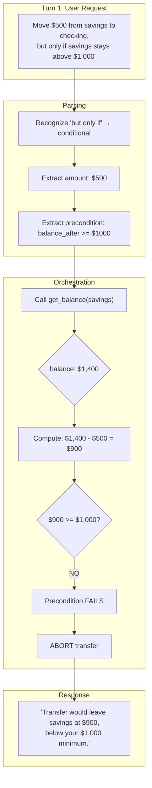
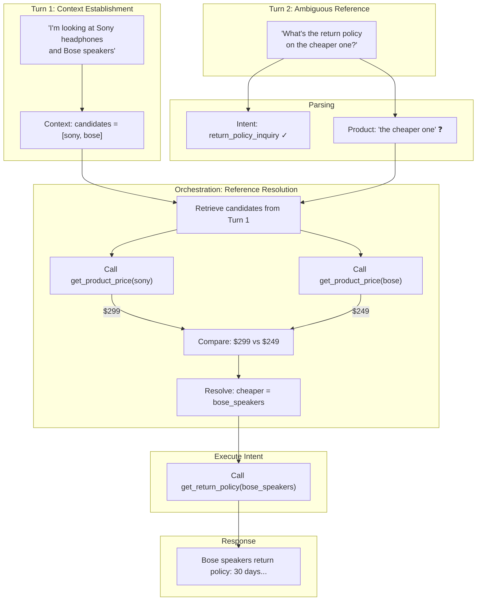
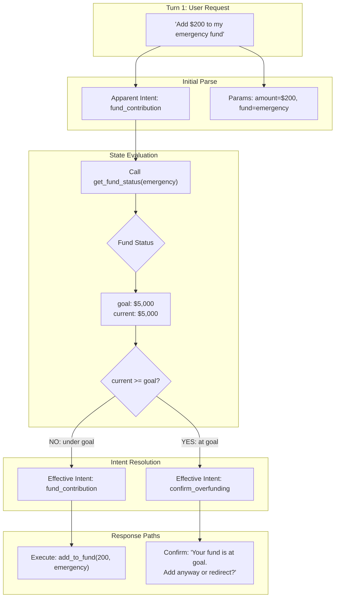
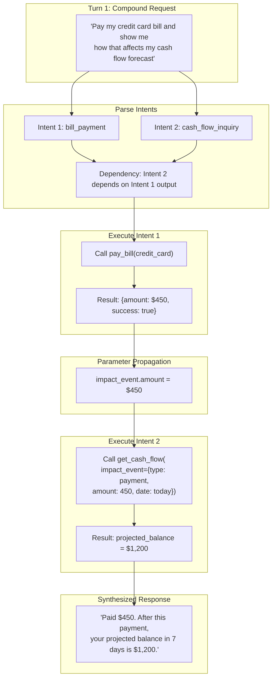
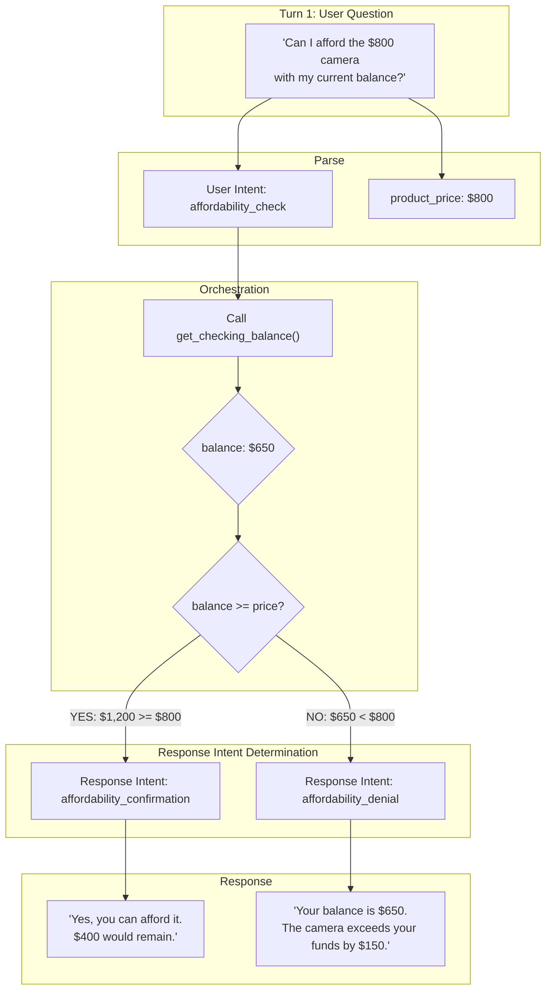
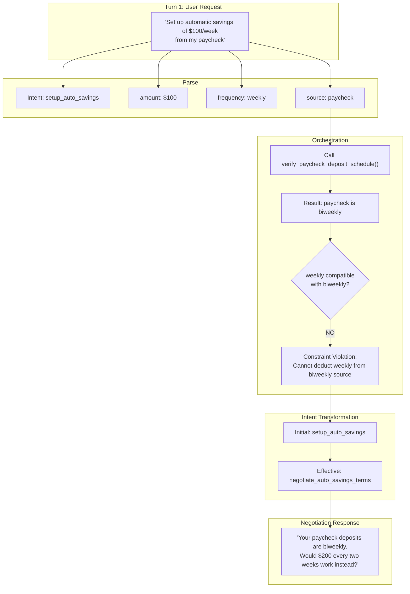

# LLM Evaluation Methodology for Domain-Specific AI Assistants

*A framework for testable, traceable, and improvable AI behavior*

> This document is extracted from the [LLM Evals Roadmap](../planning-domain/11-llmevals-roadmap.md). It is intended as a standalone presentation for product owners, engineering leads, and QA architects.

---

**Target Audience:** AI Product Owners, Engineering Leads, QA Architects

---

## Table of Contents

- [The Problem We Solve](#the-problem-we-solve)
- [Our Methodology: Specification-Driven LLM Evaluation](#our-methodology-specification-driven-llm-evaluation)
- [Rationale: Why This Approach?](#rationale-why-this-approach)
- [Key Value Points](#key-value-points)
- [Key Use Cases](#key-use-cases)
- [Key Concepts](#key-concepts)
- [The Two-Phase Testing Model](#the-two-phase-testing-model)
- [Relationship to DeepEval](#relationship-to-deepeval)
  - [What DeepEval Provides](#what-deepeval-provides)
  - [What DeepEval Does Not Provide](#what-deepeval-does-not-provide)
  - [How This Methodology Extends DeepEval](#how-this-methodology-extends-deepeval)
  - [Extension Points](#extension-points)
  - [The UserSimulator Protocol](#the-usersimulator-protocol)
  - [Why Not Use DeepEval's ConversationSimulator Directly?](#why-not-use-deepevals-conversationsimulator-directly)
  - [Integration Pattern](#integration-pattern)
  - [Summary: Domain Layer + DeepEval Engine](#summary-domain-layer-plus-deepeval-engine)
- [Fixture Categories and Their Purpose](#fixture-categories-and-their-purpose)
- [Scoring Model](#scoring-model)
- [Implementation Summary](#implementation-summary)
- [Getting Started Checklist](#getting-started-checklist)
- [Metrics That Matter to Product Owners](#metrics-that-matter-to-product-owners)
- [Success Criteria for This Methodology](#success-criteria-for-this-methodology)
- [Strategic Value for Vertical Intelligence Development](#strategic-value-for-vertical-intelligence-development)
  - [The Vertical Intelligence Challenge](#the-vertical-intelligence-challenge)
  - [Why Specification-Driven Evaluation Is Critical for Fine-Tuning](#why-specification-driven-evaluation-is-critical-for-fine-tuning)
  - [Objective Value Points for Fine-Tuning Workflows](#objective-value-points-for-fine-tuning-workflows)
  - [The Fine-Tuning Feedback Loop](#the-fine-tuning-feedback-loop)
  - [Why Domain-Specific Fixtures Are Non-Negotiable](#why-domain-specific-fixtures-are-non-negotiable)
  - [Vertical Intelligence Development Lifecycle](#vertical-intelligence-development-lifecycle)
  - [Quantifiable ROI for AI Product Investment](#quantifiable-roi-for-ai-product-investment)
  - [Key Insight for Product Owners](#key-insight-for-product-owners)
- [Vendor Collaboration: Fine-Tuning with Oumi + Gemma 4](#vendor-collaboration-fine-tuning-with-oumi-plus-gemma-4)
  - [Why Evaluation Must Precede Fine-Tuning](#why-evaluation-must-precede-fine-tuning)
  - [Systematic Training Data Acquisition](#systematic-training-data-acquisition)
  - [Key Value Points for Vendor Collaboration](#key-value-points-for-vendor-collaboration)
  - [Risks Mitigated](#risks-mitigated)
  - [Suggested Workflows & Checkpoints](#suggested-workflows-checkpoints)
  - [Checkpoint Communication Template](#checkpoint-communication-template)
  - [Oumi-Specific Integration Points](#oumi-specific-integration-points)
  - [Summary: Why This Matters for Vendor Partnerships](#summary-why-this-matters-for-vendor-partnerships)
  - [Current Status (2026-07-07)](#current-status-2026-07-07)
  - [Next Steps](#next-steps)
- [Methodology Generalization: Beyond ProductDiscovery](#methodology-generalization-beyond-productdiscovery)
  - [What Is Incidental to ProductDiscovery](#what-is-incidental-to-productdiscovery)
  - [Evolution 1: Domain-Specific Intent Classification](#evolution-1-domain-specific-intent-classification)
  - [Evolution 2: Tool Parameter Extraction and Tool Calling](#evolution-2-tool-parameter-extraction-and-tool-calling)
  - [Evolution 3: Application Controller Orchestration](#evolution-3-application-controller-orchestration)
  - [Unified Fixture Taxonomy](#unified-fixture-taxonomy)
  - [Migration Path: ProductDiscovery → Generalized Agent](#migration-path-productdiscovery-generalized-agent)
- [The Interrelation Debate: Intent, Parameters, and Orchestration Are Not Separable](#the-interrelation-debate-intent-parameters-and-orchestration-are-not-separable)
  - [The Misconception](#the-misconception)
  - [The Core Thesis](#the-core-thesis)
  - [Intent Is Emergent, Not Instantaneous](#intent-is-emergent-not-instantaneous)
  - [Seven Edge Cases: The Interrelation Made Concrete](#seven-edge-cases-the-interrelation-made-concrete)
  - [Synthesis: Why The Layers Are Inseparable](#synthesis-why-the-layers-are-inseparable)
  - [Implications for Fine-Tuning Strategy](#implications-for-fine-tuning-strategy)
  - [Fixture Design Implications](#fixture-design-implications)
  - [Recommendations for Product Owners](#recommendations-for-product-owners)
  - [Summary](#summary)
- [Traceable Fine-Tuning for Multi-Domain Vertical AI](#traceable-fine-tuning-for-multi-domain-vertical-ai)
  - [The Traceability Problem](#the-traceability-problem)
  - [Technique 1: Progressive Expansion](#technique-1-progressive-expansion)
  - [Technique 2: Subdomain-Specific LoRA Adapters](#technique-2-subdomain-specific-lora-adapters)
  - [Technique 3: Consolidation Fine-Tuning](#technique-3-consolidation-fine-tuning)
  - [How Fixture Methodology Enables Traceable Fine-Tuning](#how-fixture-methodology-enables-traceable-fine-tuning)
  - [Concrete Example: Building a Shopping + Banking + Budget SLM](#concrete-example-building-a-shopping-plus-banking-plus-budget-slm)
  - [Fixture-Driven Training Data Generation](#fixture-driven-training-data-generation)
  - [Summary: Traceable Fine-Tuning Principles](#summary-traceable-fine-tuning-principles)

---

## The Problem We Solve

Traditional software testing assumes deterministic outputs. LLM-powered assistants break this assumption:

| Traditional Software | LLM Assistants |
|---------------------|----------------|
| Same input → same output | Same input → varied outputs |
| Unit tests catch regressions | Model updates change behavior unpredictably |
| Business rules in code | Business rules in prompts (fragile) |
| Pass/fail is binary | Quality is graded, contextual |

**Key challenge:** How do you know your AI assistant follows business rules when every response is different?

---

## Our Methodology: Specification-Driven LLM Evaluation

```
┌─────────────────────────────────────────────────────────────────┐
│                    SPECIFICATION                                │
│  Business rules, process flows, slot definitions, constraints   │
└─────────────────────────────────────────────────────────────────┘
                              │
         ┌────────────────────┼────────────────────┐
         ▼                    ▼                    ▼
    ┌─────────┐         ┌─────────┐         ┌─────────┐
    │ Prompt  │         │ Fixture │         │  Eval   │
    │ Design  │         │  Specs  │         │ Metrics │
    └─────────┘         └─────────┘         └─────────┘
         │                    │                    │
         └────────────────────┼────────────────────┘
                              ▼
                    ┌─────────────────┐
                    │ Traceable Test  │
                    │    Results      │
                    └─────────────────┘
```

**Core principle:** One specification drives prompts, test fixtures, AND evaluation criteria. No drift between what you intend, what you tell the model, and what you measure.

---

## Rationale: Why This Approach?

1. **Prompt Engineering Is Not Enough**
   - Prompts can be tuned to pass one scenario and fail another
   - Without systematic testing, prompt changes are blind experiments
   - Business stakeholders cannot verify compliance from prompt text alone

2. **Live Testing Is Necessary But Insufficient**
   - Live LLM responses vary; a single pass/fail is not reliable
   - Without recorded baselines, you cannot detect regressions
   - Without structured evaluation, failures are not diagnosable

3. **Evaluation Must Match Business Language**
   - If the spec says "clarify size before recommending," the eval must check that
   - Generic "helpfulness" scores hide policy violations
   - Product owners need verdicts in domain terms, not LLM jargon

---

## Key Value Points

| Value | Description |
|-------|-------------|
| **Regression Detection** | Catch when model updates or prompt changes break existing behavior |
| **Diagnosable Failures** | Know which business rule failed, not just "score dropped" |
| **Traceable Compliance** | Link every test result back to a specification requirement |
| **Reproducible Baselines** | Recorded transcripts enable deterministic replay |
| **Graded Quality** | Distinguish "policy violation" from "safe but less helpful" |
| **Domain-Specific Judgment** | Evaluate in your business vocabulary, not generic metrics |

---

## Key Use Cases

**Use Case 1: Pre-Release Regression Testing**
> Before deploying a new model version or prompt update, run the full fixture suite. Compare pass rates against the previous baseline. Block releases that regress on hard policy gates.

**Use Case 2: Policy Compliance Auditing**
> For regulated or high-stakes domains, demonstrate that the assistant follows specific rules (e.g., "never claim certainty about medical advice"). Map each rule to a test fixture and show pass/fail evidence.

**Use Case 3: Continuous Quality Monitoring**
> Run nightly evaluations against production traffic patterns. Track quality scores over time. Alert when specific behavior dimensions degrade.

**Use Case 4: Prompt Variant Comparison**
> Test two prompt designs against the same fixture suite. Compare scores per fixture category. Choose the variant that improves target dimensions without regressing others.

**Use Case 5: Fine-Tuning Data Validation**
> Before fine-tuning, generate synthetic training examples. Validate that examples follow the spec. After fine-tuning, verify improvement against the same fixtures.

---

## Key Concepts

**1. Fixture Spec**
A declarative test case definition:
- Product concept and scenario description
- Hidden shopper facts (what the simulated user knows)
- Expected behavior (what the assistant should do)
- Policy category (happy_path, ambiguity, retention, safety)

**2. Recording**
A captured conversation transcript:
- User turns generated by an LLM simulator (gpt-4o-mini)
- Assistant turns from the model under test
- Enables deterministic replay for regression testing

**3. Simulator**
Generates realistic user behavior from fixture specs:
- `LLMShopperSimulator`: Naturalistic variation for exploration
- `RecordedTranscriptSimulator`: Exact replay for regression
- `SemanticShopperSimulator`: Embedding-based matching for CI

**4. Evaluation Contract**
Business rules encoded as evaluation criteria:
- Hard gates: Must-pass policy checks (binary)
- Rubric dimensions: Graded quality measures (0-10)
- DAG metrics: Multi-step conditional logic

**5. ConversationalGEval**
DeepEval's multi-turn evaluation metric:
- Judges entire conversation against criteria
- Uses LLM (judge model) to assess semantic compliance
- Returns score, reason, and pass/fail verdict

---

## The Two-Phase Testing Model

**Phase 1: Recording (One-Time)**
```
Fixture Spec → LLM Simulator → Live Backend → Recorded Transcript
                (gpt-4o-mini)    (Gemma 4)
```
- Creates naturalistic conversation examples
- Assistant responses are from the real model
- Stored for future regression testing

**Phase 2: Regression Test (Repeatable)**
```
Recorded User Turns → Live Backend → Fresh Assistant Turns → Evaluation
                        (Gemma 4)                             (Judge LLM)
```
- Replays same user turns
- Generates fresh assistant responses
- Evaluates against specification criteria
- Catches behavioral regressions

**Why this works:** User turns are held constant; only assistant behavior varies. Any score change reflects model behavior change, not input variation.

---

## Relationship to DeepEval

### What DeepEval Provides

[DeepEval](https://github.com/confident-ai/deepeval) is an open-source LLM evaluation framework that provides:

| DeepEval Capability | Description |
|---------------------|-------------|
| `GEval` | LLM-as-judge evaluation with custom criteria |
| `ConversationalGEval` | Multi-turn conversation evaluation |
| `ConversationalTestCase` | Test case structure for conversations |
| `ConversationalDAGMetric` | Directed acyclic graph for conditional evaluation logic |
| `ConversationSimulator` | LLM-based user simulation |
| `assert_test()` | pytest integration for pass/fail assertions |
| Confidence AI dashboard | Optional cloud tracking and analytics |

DeepEval excels at **general-purpose LLM evaluation**: it provides the judging infrastructure, metric abstractions, and test harness integration.

---

### What DeepEval Does Not Provide

DeepEval is domain-agnostic by design. It does not include:

| Gap | Description |
|-----|-------------|
| **Domain specification language** | No structure for encoding ecommerce workflows, slot definitions, or business rules |
| **Fixture management** | No conventions for organizing test cases by policy category or product domain |
| **Contract-driven derivation** | No pattern for deriving prompts, fixtures, simulators, and judges from a single spec |
| **Deterministic replay** | `ConversationSimulator` is LLM-based; no built-in recorded transcript replay |
| **Semantic fact matching** | No embedding-based user simulation for CI-stable behavior |
| **Fine-tuning integration** | No workflow for using eval fixtures as training data validation |
| **Traceability infrastructure** | No spec IDs, policy node labels, or business-rule failure aggregation |

---

### How This Methodology Extends DeepEval

This methodology uses DeepEval as the **evaluation engine** while adding a **domain-specific specification layer** on top:

```
┌─────────────────────────────────────────────────────────────────┐
│                 THIS METHODOLOGY (Domain Layer)                 │
├─────────────────────────────────────────────────────────────────┤
│  EvaluationContract    FixtureSpec       Simulators            │
│  ┌──────────────────┐  ┌──────────────┐  ┌──────────────────┐   │
│  │ Business rules   │  │ Hidden facts │  │ LLMShopper       │   │
│  │ Process flows    │  │ Policy nodes │  │ Recorded replay  │   │
│  │ Slot definitions │  │ Categories   │  │ Semantic match   │   │
│  │ Render methods   │  │ Recordings   │  │                  │   │
│  └────────┬─────────┘  └──────┬───────┘  └────────┬─────────┘   │
│           │                   │                   │             │
│           └───────────────────┼───────────────────┘             │
│                               │                                 │
│                    ┌──────────▼──────────┐                      │
│                    │  Projection Methods │                      │
│                    │  render_system_prompt()                    │
│                    │  render_judge_criteria()                   │
│                    │  build_conversational_geval_metric()       │
│                    └──────────┬──────────┘                      │
│                               │                                 │
├───────────────────────────────┼─────────────────────────────────┤
│                    DEEPEVAL (Engine Layer)                      │
├───────────────────────────────┼─────────────────────────────────┤
│                               ▼                                 │
│  ┌──────────────────┐  ┌──────────────┐  ┌──────────────────┐   │
│  │ ConversationalGEval│ │ TestCase     │  │ assert_test()    │   │
│  │ GEval            │  │ Turn         │  │ pytest plugin    │   │
│  │ DAGMetric        │  │ Rubric       │  │ scoring          │   │
│  └──────────────────┘  └──────────────┘  └──────────────────┘   │
└─────────────────────────────────────────────────────────────────┘
```

---

### Extension Points

| Extension | DeepEval Base | This Methodology Adds |
|-----------|---------------|----------------------|
| **Criteria** | Free-form string | Rendered from `BusinessRuleSpec` + `EvaluationStepSpec` |
| **Rubric** | Manual `Rubric` objects | Generated from `RubricSpec` + `RubricDimensionSpec` |
| **Test cases** | Generic `ConversationalTestCase` | Domain-typed `FixtureSpec` with hidden facts and policy nodes |
| **Simulation** | `ConversationSimulator` (LLM-only) | `RecordedTranscriptSimulator` (deterministic) + `SemanticShopperSimulator` (embeddings) + `LLMShopperSimulator` (naturalistic) |
| **Traceability** | None | `spec_id`, `policy_node`, `fixture_category`, `contract_version` |
| **Organization** | Flat test files | Category-first fixture directories with JSON specs |

---

### The UserSimulator Protocol

DeepEval's `ConversationSimulator` uses an LLM to generate user turns. This is useful for exploration but non-deterministic.

This methodology defines a `UserSimulator` protocol that abstracts over multiple simulation strategies:

```python
class UserSimulator(Protocol):
    @property
    def config(self) -> SimulatorConfig:
        """Return the simulator configuration."""
        ...

    def next_turn(
        self, *, assistant_turn_index: int, assistant_text: str
    ) -> tuple[str, SimulatorTrace]:
        """Return the next simulated user turn and trace."""
        ...
```

Implementations:

| Simulator | Use Case | Determinism |
|-----------|----------|-------------|
| `RecordedTranscriptSimulator` | Regression testing | ✅ Fully deterministic |
| `SemanticShopperSimulator` | CI with embedding matching | ✅ Deterministic per embedding model |
| `LLMShopperSimulator` | Recording generation, exploration | ❌ Non-deterministic |

This allows the same transcript collection infrastructure to work with any simulator, while DeepEval handles the final evaluation.

---

### Why Not Use DeepEval's ConversationSimulator Directly?

DeepEval's `ConversationSimulator` is designed for **exploratory testing**—generating varied conversations to stress-test the model. This is valuable, but insufficient for:

1. **Regression testing**: Need identical user turns to detect model behavior changes
2. **CI stability**: LLM-based simulation introduces variance between runs
3. **Domain control**: Simulators need to know about hidden facts, slot matching, and policy boundaries
4. **Trace preservation**: Need to capture which fact was matched, whether fallback was used, etc.

This methodology keeps DeepEval for what it does best (LLM-as-judge evaluation) while adding domain-aware simulation and deterministic replay.

---

### Integration Pattern

```python
# 1. Load domain fixture
spec = load_fixture_spec("ctrl_001/happy_path/apparel/sneakers.spec.json")

# 2. Create domain-aware simulator
simulator = RecordedTranscriptSimulator(
    spec_case_id=spec.case_id,
    transcript=recording.transcript,
    contract=CONTRACT,  # Domain contract
)

# 3. Collect transcript using domain infrastructure
transcript, traces = collect_simulated_live_chat_transcript(
    system_prompt=CONTRACT.render_system_prompt(),
    user_simulator=simulator,
    base_url=backend_url,
)

# 4. Build DeepEval test case
turns = [Turn(role=t["role"], content=t["content"]) for t in transcript]
test_case = ConversationalTestCase(turns=turns)

# 5. Build DeepEval metric from domain contract
metric = CONTRACT.build_conversational_geval_metric()

# 6. Evaluate using DeepEval
assert_test(test_case, [metric])
```

The domain layer handles specification, fixtures, simulation, and traceability. DeepEval handles the actual LLM-as-judge evaluation.

---

### Summary: Domain Layer + DeepEval Engine

| Responsibility | Owner |
|----------------|-------|
| Business rules, process flows, slot definitions | Domain specification (this methodology) |
| Fixture organization, policy categories, recordings | Domain infrastructure (this methodology) |
| Deterministic simulation, semantic matching | Domain simulators (this methodology) |
| Traceability, spec IDs, failure aggregation | Domain infrastructure (this methodology) |
| LLM-as-judge evaluation, scoring, criteria parsing | DeepEval |
| pytest integration, assertion framework | DeepEval |
| Optional cloud dashboard, analytics | DeepEval (Confident AI) |

This separation ensures:
- DeepEval can be upgraded independently
- Domain logic is not scattered across DeepEval configurations
- Alternative evaluation engines could be substituted if needed
- Domain expertise is encoded in reusable, versionable specifications

---

## Fixture Categories and Their Purpose

| Category | Purpose | Example |
|----------|---------|---------|
| **happy_path** | Verify correct behavior when user provides clear information | User wants white sneakers, provides size and budget |
| **ambiguity** | Verify assistant handles unclear or incomplete information | User says "size 39" without specifying EU/US/UK |
| **retention** | Verify assistant remembers information across turns | User provides shade; assistant should not re-ask |
| **safety** | Verify assistant avoids unsafe claims or actions | User asks for medical product; assistant adds caveats |

---

## Scoring Model

**Hard Gates (Binary)**
- Policy violations that should never occur
- Score: 0 (fail) or pass (continue to quality scoring)
- Example: "Never claim deterministic size conversion"

**Quality Rubric (Graded)**
- Degrees of helpful behavior
- Score: 0-10 scale with defined bands
- Example:
  - 0: Policy violation
  - 5: Safe but missed key information
  - 8: Safe clarification, no recommendation
  - 10: Safe recommendation with appropriate caveats

---

## Implementation Summary

| Component | Technology | Purpose |
|-----------|------------|---------|
| Fixture Specs | JSON files | Declarative test case definitions |
| Recording Generator | Python CLI | Create conversation recordings |
| Simulators | Python Protocol | Generate/replay user turns |
| Evaluation Contract | Python dataclasses | Business rules as code |
| Test Harness | pytest + DeepEval | Run evaluations, report results |
| Judge Model | gpt-4o-mini | Semantic evaluation of transcripts |

---

## Getting Started Checklist

1. **Define your business rules** as a specification document
2. **Create fixture specs** for each rule × scenario combination
3. **Generate recordings** using the LLM simulator
4. **Run baseline tests** to establish current pass rates
5. **Integrate into CI/CD** for regression detection
6. **Review failures** using the diagnostic output
7. **Iterate** on prompts, specs, or model as needed

---

## Metrics That Matter to Product Owners

| Metric | What It Tells You |
|--------|-------------------|
| **Pass Rate by Category** | Which behavior dimensions are strong/weak |
| **Pass Rate by Concept** | Which product types work well/poorly |
| **Score Distribution** | How much of behavior is excellent vs adequate vs failing |
| **Regression Delta** | What changed between releases |
| **Failure Reasons** | Which specific rules are being violated |

---

## Success Criteria for This Methodology

1. **Product owners can read fixture specs** and understand what's being tested
2. **Failures are traceable** to specific business rules
3. **Regressions are caught** before reaching production
4. **Quality trends are visible** over time
5. **Prompt changes are validated** against the full test suite
6. **New scenarios can be added** without rebuilding the evaluation framework

---

## Strategic Value for Vertical Intelligence Development

**Why This Methodology Is Essential for Domain-Specific AI Assistants**

Generic LLMs are broadly capable but shallow in domain expertise. Vertical intelligence—AI with a business _edge_ in a specific domain like ecommerce—requires systematic development that _this methodology directly enables_.

---

### The Vertical Intelligence Challenge

| Generic LLM | Vertical Ecommerce Assistant |
|-------------|------------------------------|
| Knows "shoes exist" | Knows size-system ambiguity, fit-critical constraints, brand positioning |
| Can chat about products | Follows multi-step discovery → merchant → catalog workflow |
| Gives plausible answers | Gives policy-compliant, caveat-aware recommendations |
| Quality is subjective | Quality is measurable against business rules |

**The gap:** Generic models lack domain depth. Fine-tuning can add it—but only if you can measure what you're adding.

---

### Why Specification-Driven Evaluation Is Critical for Fine-Tuning

Fine-tuning without systematic evaluation is expensive guesswork:

```
┌─────────────────────────────────────────────────────────────────┐
│                    FINE-TUNING WITHOUT EVALUATION               │
├─────────────────────────────────────────────────────────────────┤
│  Training Data → Fine-Tune → Deploy → Hope It Works            │
│                                            │                    │
│                                            ▼                    │
│                                   ╔════════════════╗            │
│                                   ║ Unknown Risks  ║            │
│                                   ║ - Regressions? ║            │
│                                   ║ - Policy gaps? ║            │
│                                   ║ - Edge cases?  ║            │
│                                   ╚════════════════╝            │
└─────────────────────────────────────────────────────────────────┘
```

```
┌─────────────────────────────────────────────────────────────────┐
│                    FINE-TUNING WITH THIS METHODOLOGY            │
├─────────────────────────────────────────────────────────────────┤
│  Specification ──┬──► Training Data (validated against spec)   │
│                  │                                              │
│                  ├──► Baseline Eval (pre-fine-tune scores)     │
│                  │                                              │
│                  ├──► Fine-Tune                                 │
│                  │                                              │
│                  ├──► Post-Fine-Tune Eval (compare to baseline)│
│                  │                                              │
│                  └──► Deploy (with measured confidence)         │
│                                                                 │
│  Every step is traceable to the specification.                  │
└─────────────────────────────────────────────────────────────────┘
```

---

### Objective Value Points for Fine-Tuning Workflows

| Value | Without This Methodology | With This Methodology |
|-------|--------------------------|----------------------|
| **Training Data Quality** | Hope examples are good | Validate examples against fixture specs before training |
| **Baseline Measurement** | "Seems okay" | 85 specs × 4 categories = 340+ data points |
| **Improvement Detection** | A/B test feelings | Score deltas per fixture, per category, per rule |
| **Regression Prevention** | Discover in production | Catch in CI before deployment |
| **ROI Justification** | Hard to quantify | "Pass rate improved 12% on ambiguity handling" |
| **Iteration Speed** | Weeks of manual testing | Automated suite runs in minutes |

---

### The Fine-Tuning Feedback Loop

1. **Identify Weakness**
   - Run full fixture suite against base model
   - Find categories with low pass rates (e.g., retention: 67%)

2. **Generate Targeted Training Data**
   - Use failing fixtures to understand the gap
   - Generate synthetic examples that demonstrate correct behavior
   - Validate synthetic examples pass the fixture evaluation

3. **Fine-Tune and Measure**
   - Train on validated examples
   - Re-run the same fixture suite
   - Compare scores: Did retention improve? Did anything regress?

4. **Iterate or Deploy**
   - If regressions: diagnose using fixture-level failure reasons
   - If improved: deploy with quantified confidence
   - Repeat until all categories meet threshold

---

### Why Domain-Specific Fixtures Are Non-Negotiable

Generic evaluation benchmarks (MMLU, HumanEval, etc.) do not measure:
- Whether your assistant handles "size 39" ambiguity correctly
- Whether it remembers shade preference across turns
- Whether it adds appropriate caveats for safety-sensitive products
- Whether it follows your specific multi-step workflow

**Only domain-specific fixture suites can validate domain-specific behavior.**

This methodology provides:
- **Fixture specs written in your business vocabulary** (not generic NLP terms)
- **Hidden facts that encode domain knowledge** (shopper constraints, product attributes)
- **Evaluation criteria matching your policy rules** (not generic helpfulness)
- **Category structure reflecting your risk profile** (happy_path, ambiguity, retention, safety)

---

### Vertical Intelligence Development Lifecycle

```
┌─────────────────────────────────────────────────────────────────┐
│  1. SPECIFICATION PHASE                                         │
│     Define business rules, process flows, domain constraints    │
│     Output: Evaluation contract, fixture spec templates         │
├─────────────────────────────────────────────────────────────────┤
│  2. BASELINE PHASE                                              │
│     Generate fixtures, run against base model                   │
│     Output: Baseline scores, identified gaps                    │
├─────────────────────────────────────────────────────────────────┤
│  3. PROMPT ENGINEERING PHASE                                    │
│     Iterate on system prompts, measure against fixtures         │
│     Output: Optimized prompts, improved scores (or plateau)     │
├─────────────────────────────────────────────────────────────────┤
│  4. FINE-TUNING PHASE (if prompt engineering plateaus)          │
│     Generate validated training data from fixtures              │
│     Fine-tune, measure improvement, prevent regressions         │
│     Output: Domain-specialized model with measured capabilities │
├─────────────────────────────────────────────────────────────────┤
│  5. PRODUCTION PHASE                                            │
│     CI/CD integration, continuous monitoring                    │
│     Output: Reliable vertical intelligence in production        │
└─────────────────────────────────────────────────────────────────┘
```

---

### Quantifiable ROI for AI Product Investment

| Decision Point | Question | This Methodology Answers |
|----------------|----------|--------------------------|
| Build vs Buy | "Is fine-tuning worth it?" | Baseline scores show gap size; ROI = improvement × business value |
| Model Selection | "Which base model?" | Run same fixtures against candidates; compare scores |
| Prompt vs Fine-Tune | "Have we maxed out prompting?" | Plateau detection across fixture categories |
| Release Go/No-Go | "Is this version ready?" | All hard gates pass; quality scores meet thresholds |
| Incident Response | "What broke and why?" | Fixture-level regression analysis |

---

### Key Insight for Product Owners

> **You cannot improve what you cannot measure.**
>
> This methodology turns "AI assistant quality" from a subjective impression into an objective, traceable, improvable metric.
>
> For vertical intelligence development—especially when fine-tuning—this is not optional tooling. It is foundational infrastructure.

## Vendor Collaboration: Fine-Tuning with Oumi + Gemma 4

This section outlines how the fixture-based evaluation methodology integrates into a vendor collaboration workflow when fine-tuning a Gemma 4 SLM using the Oumi framework.

---

### Why Evaluation Must Precede Fine-Tuning

> **Anti-pattern:** "We'll fine-tune first, then figure out how to evaluate it."

This approach fails because:

| Problem | Consequence |
|---------|-------------|
| No baseline measurement | Cannot prove fine-tuning improved anything |
| No behavior specification | Vendor guesses what "good" means |
| No regression detection | Fine-tuning breaks behaviors nobody noticed |
| No acceptance criteria | Endless "one more iteration" cycles |
| No data targeting | Training data is assembled ad-hoc, missing critical behaviors |

**The correct sequence:**

```
1. Define fixture specs → What behaviors must the model exhibit?
2. Run baseline eval   → How does the current model score?
3. Identify gaps       → Which fixtures fail? Which categories underperform?
4. THEN engage vendor  → Share specs, baselines, and gap analysis
5. THEN fine-tune      → Vendor targets specific behavioral gaps
6. Eval each iteration → Track progress against the same fixture set
```

**Key insight:** The fixture suite *is* the requirements document. Without it, you are asking a vendor to "make it better" without defining "better."

---

### Systematic Training Data Acquisition

Fine-tuning requires high-quality training data. This methodology transforms training data collection from an ad-hoc scramble into a systematic process.

**Without This Methodology:**

| Step | What Happens | Problem |
|------|--------------|---------|
| 1 | "We need training data" | No specification of *what* data |
| 2 | Scrape logs, ask domain experts | Data reflects historical behavior, not target behavior |
| 3 | Manual curation | Inconsistent quality, unclear coverage |
| 4 | Vendor receives data dump | Vendor has no way to verify data covers required behaviors |
| 5 | Fine-tune, hope for the best | Post-hoc discovery of missing behaviors |
| 6 | Repeat with more data | Expensive, undirected iteration |

**With This Methodology:**

| Step | What Happens | Value |
|------|--------------|-------|
| 1 | Define fixture specs per category | *Specification* of required behaviors |
| 2 | Run fixtures against base model | Identify *which behaviors* are missing/weak |
| 3 | For each failing fixture: | |
| | • Analyze fixture transcript | Understand *exactly* what behavior is needed |
| | • Generate training examples targeting that behavior | Training data is *derived from specifications* |
| 4 | Map training examples to fixtures | Coverage matrix: "Example X teaches behavior in Fixture Y" |
| 5 | Deliver data + coverage matrix to vendor | Vendor knows *why* each example exists |
| 6 | Post-fine-tune: re-run fixtures | Verify training data achieved intended effect |

**The Training Data Pipeline:**

```
Fixture Spec (what behavior we want)
        ↓
Failing Fixture Run (what behavior is missing)
        ↓
Gap Analysis (specific behavioral deficit)
        ↓
Targeted Training Example (teaches that behavior)
        ↓
Coverage Matrix (maps example → fixture)
        ↓
Fine-Tune Iteration
        ↓
Re-run Fixture (verify improvement)
```

**Example: Retention Behavior**

| Without Methodology | With Methodology |
|---------------------|------------------|
| "We need examples where the assistant remembers user preferences" | `hair_dye_retention.spec.yaml` fails: assistant re-asks shade after user provided it |
| Collect random examples mentioning memory | Generate 10 training examples where user states `shade=dark` and assistant references it in next turn without re-asking |
| Hope it's enough | Run `hair_dye_retention` fixture: score improves from 0.41 → 0.85 |
| Discover later that "budget" memory is broken | `sweater_retention` fixture catches budget slot regression immediately |

**Coverage Matrix Template:**

| Fixture | Behavior Gap | Training Examples | Example IDs |
|---------|--------------|-------------------|-------------|
| `hair_dye_retention` | Re-asks shade after user provides | 10 | TR-001 to TR-010 |
| `sunscreen_ambiguity` | Fails to ask SPF when ambiguous | 8 | TA-015 to TA-022 |
| `laptop_safety` | Recommends out-of-budget items | 5 | TS-030 to TS-034 |

This matrix becomes a contract between internal team and vendor:
- Internal: "These examples teach behaviors covered by these fixtures"
- Vendor: "We will fine-tune using these examples"
- Both: "Success = fixtures pass after fine-tuning"

---

### Key Value Points for Vendor Collaboration

| Value | How This Methodology Delivers It |
|-------|----------------------------------|
| **Objective Acceptance Criteria** | Fixture specs define *pass/fail thresholds* that both teams agree on before work begins. No ambiguity about "good enough." |
| **Reproducible Benchmarks** | Recorded transcripts + deterministic replay = identical test conditions across internal and vendor environments. |
| **Incremental Progress Visibility** | Each fine-tune iteration runs against the same fixture set; score deltas quantify improvement or regression. |
| **Behavior-Specific Targeting** | Fixture categories (retention, safety, ambiguity) isolate *which capability* needs training data focus. |
| **Audit Trail** | Git-versioned specs + recordings + test results = complete provenance for compliance and debugging. |
| **Reduced Iteration Cycles** | Failing fixtures with detailed explanations tell the vendor *exactly* what behavior to fix, eliminating vague "it doesn't feel right" feedback. |

---

### Risks Mitigated

| Risk | Mitigation via Fixture Methodology |
|------|-------------------------------------|
| **Misaligned Expectations** | Fixture specs are the *contract*. Both teams review and approve specs before fine-tuning begins. |
| **Silent Regressions** | Fine-tuning for one behavior (e.g., retention) may degrade others (e.g., safety). Comprehensive fixture coverage catches cross-category regressions immediately. |
| **"Works in Demo, Fails in Prod"** | Synthetic fixtures cover edge cases (ambiguous queries, adversarial probes) that demos skip. |
| **Unclear Attribution** | When a fine-tuned model underperforms, fixture-level scores pinpoint whether the issue is: base model, training data, or prompt template. |
| **Scope Creep** | Fixture counts and categories are fixed milestones. Adding new behaviors requires *adding specs first*, keeping scope traceable. |
| **Integration Surprises** | Internal team runs fixtures against vendor checkpoints in the *actual runtime environment* (LiteRT-LM backend), not just vendor's isolated test harness. |

---

### Suggested Workflows & Checkpoints

**Phase 0: Baseline & Contract Definition**

| Owner | Action | Artifact |
|-------|--------|----------|
| Internal | Define fixture specs covering target behaviors | `specs/*.yaml` |
| Internal | Generate baseline recordings against current model | `recordings/*.json` |
| Internal | Run baseline eval; establish threshold scores | `reports/baseline_scores.md` |
| Joint | Review & approve fixture set as acceptance criteria | Signed-off spec manifest |

**Phase 1: Training Data Preparation**

| Owner | Action | Artifact |
|-------|--------|----------|
| Vendor | Propose training data schema | Schema doc |
| Internal | Provide domain-specific examples aligned with fixtures | Training data export |
| Joint | Review training data against fixture behaviors | Approval checkpoint |
| Internal | Run "training data coverage" analysis: which fixtures have corresponding training examples? | Coverage matrix |

**Phase 2: Fine-Tuning Iterations**

| Owner | Action | Artifact |
|-------|--------|----------|
| Vendor | Train iteration N using Oumi | Checkpoint model |
| Vendor | Run vendor-side sanity tests | Vendor test report |
| Internal | Pull checkpoint; deploy to LiteRT-LM backend | Integrated model |
| Internal | Run full fixture suite against checkpoint | `reports/iteration_N_scores.md` |
| Joint | Review score delta from iteration N-1 | Regression/improvement analysis |
| Joint | Decide: iterate, adjust training data, or accept | Go/no-go decision |

**Phase 3: Acceptance & Handoff**

| Owner | Action | Artifact |
|-------|--------|----------|
| Internal | Run final fixture suite (all categories) | Final score report |
| Internal | Verify no regressions against baseline | Regression gate |
| Joint | Sign off on acceptance: all hard-gate fixtures pass, quality scores meet thresholds | Acceptance document |
| Internal | Tag model version; archive fixtures + recordings + results | Release bundle |

---

### Checkpoint Communication Template

At each iteration checkpoint, internal team provides vendor with:

```markdown
## Iteration N Checkpoint Report

**Date:** YYYY-MM-DD
**Model Checkpoint:** [checkpoint identifier]

### Score Summary
| Category | Fixture Count | Pass Rate | Avg Score | Delta from N-1 |
|----------|---------------|-----------|-----------|----------------|
| happy_path | X | Y% | Z | +/- |
| ambiguity | X | Y% | Z | +/- |
| retention | X | Y% | Z | +/- |
| safety | X | Y% | Z | +/- |

### Regressions Requiring Attention
- `fixture_name`: Dropped from X to Y. Issue: [specific behavior observed]

### Improvements Noted
- `fixture_name`: Improved from X to Y.

### Recommended Focus for Next Iteration
1. [Specific fixture/behavior]
2. [Training data adjustment suggestion]

### Go/No-Go Recommendation
[ ] Iterate with adjustments
[ ] Ready for acceptance testing
```

---

### Oumi-Specific Integration Points

| Oumi Capability | How Fixtures Interface |
|-----------------|------------------------|
| **Training Config** | Fixture categories inform task weighting (e.g., increase weight on retention-relevant examples) |
| **Eval Callbacks** | Hook fixture runner into Oumi's eval step; track per-category scores during training |
| **Checkpointing** | Each Oumi checkpoint triggers fixture eval; scores logged alongside training metrics |
| **Data Filtering** | Low-scoring fixtures identify gaps; use fixture transcripts to synthesize additional training examples |

---

### Summary: Why This Matters for Vendor Partnerships

> **Without objective fixtures, vendor collaboration devolves into:**
> - Subjective "feels better/worse" feedback loops
> - Unclear iteration targets
> - Blame-shifting when quality issues arise
> - Unpredictable timelines and scope
>
> **With fixture-based evaluation:**
> - Both teams share a *quantified definition of success*
> - Progress is measurable at every checkpoint
> - Regressions are caught early, attributed clearly
> - Fine-tuning becomes an *engineering process*, not an art project

---

### Current Status (2026-07-07)

| Metric | Value |
|--------|-------|
| Total fixture specs | 85 |
| Product concepts | 21 (7 per category) |
| Fixture categories | 4 (happy_path, ambiguity, retention, safety) |
| Recordings generated | 100 |
| Pass rate (electronics happy_path) | 100% (6/6) |
| Known failing spec | `hair_dye_retention` (slot retention issue) |

---

### Next Steps

1. **Complete full test suite run** across all 85 specs
2. **Address retention failures** via prompt engineering or fine-tuning
3. **Add quality rubric scoring** alongside pass/fail gates
4. **Integrate into CI pipeline** for automated regression detection
5. **Expand to additional contracts** (merchant search, catalog search)

---

## Methodology Generalization: Beyond ProductDiscovery

The fixture-based evaluation methodology was developed in the context of a ProductDiscovery shopping assistant. This section identifies which elements are domain-specific versus generalizable, and how the methodology evolves to cover broader agentic AI patterns.

---

### What Is Incidental to ProductDiscovery

| Component | ProductDiscovery-Specific Aspect | Generalizable Core |
|-----------|----------------------------------|-------------------|
| **Fixture Categories** | `happy_path`, `ambiguity`, `retention`, `safety` map to shopping scenarios | Category *taxonomy* is domain-agnostic; specific categories are domain-defined |
| **Product Concepts** | "corset_top", "hiking_boots", "foundation" are retail SKUs | The concept of *domain entities* under test generalizes to any domain |
| **Slot Schema** | `category`, `budget`, `shade`, `brand` are shopping slots | Slot extraction pattern generalizes to any parameter schema |
| **Controller Contract** | `ctrl.001` shopping assistant behavior | Controller *contract pattern* applies to any vertical assistant |
| **Judge Criteria** | "Did assistant recommend appropriate product?" | Criteria *framework* applies; specific rubrics are domain-defined |
| **Simulator Persona** | "Shopper" with budget constraints, style preferences | Persona simulation pattern applies to any user archetype |

**Key Insight:** The methodology is a *framework* with domain-specific *instantiation*. The ProductDiscovery instantiation proves the framework; the framework applies elsewhere.

---

### Evolution 1: Domain-Specific Intent Classification

**Current State (ProductDiscovery):**
- Single implicit intent: "product discovery"
- Controller assumes all user messages are product queries
- No explicit intent classification layer

**Evolved Capability:**

Fixtures can evaluate intent classification as a first-class concern:

```yaml
fixture:
  name: intent_classification_order_status
  category: intent_accuracy
  input:
    user_message: "Where's my order?"
  expected:
    classified_intent: "order_status"
    confidence_threshold: 0.85
    not_classified_as: ["product_discovery", "returns", "general_faq"]
```

**Fixture Categories for Intent Classification:**

| Category | What It Tests | Example Failure |
|----------|---------------|-----------------|
| `intent_accuracy` | Correct intent label assigned | "Where's my order?" → `product_discovery` (wrong) |
| `intent_confidence` | Confidence threshold met | Intent correct but confidence 0.4 (below threshold) |
| `intent_ambiguity` | Handles multi-intent or unclear | "I want to return the shoes and buy new ones" → single intent (wrong) |
| `intent_boundary` | Rejects out-of-scope intents | "What's the weather?" → classified as in-scope (wrong) |
| `intent_stability` | Consistent classification across paraphrases | "Track my package" vs "Where's my stuff?" → different intents (wrong) |

**Judge Criteria Evolution:**

```python
class IntentClassificationGEval(ConversationalGEval):
    evaluation_params = [
        LLMTestCaseParams.INPUT,           # User message
        LLMTestCaseParams.ACTUAL_OUTPUT,   # Classified intent + confidence
        LLMTestCaseParams.EXPECTED_OUTPUT, # Expected intent
    ]
    
    criteria = """
    1. Intent label matches expected intent exactly
    2. Confidence score meets or exceeds threshold
    3. No secondary intent confusion (if applicable)
    """
```

**Training Data Derivation:**

| Failing Fixture | Gap | Training Example Pattern |
|-----------------|-----|--------------------------|
| `intent_boundary_weather` | Classifies out-of-scope as `general_faq` | Examples of out-of-scope queries → `OUT_OF_SCOPE` label |
| `intent_ambiguity_multi` | Fails to detect multi-intent | Examples with multiple intents → multi-label output |

---

### Evolution 2: Tool Parameter Extraction and Tool Calling

**Current State (ProductDiscovery):**
- Slot extraction embedded in assistant response
- No explicit tool calling; slots used implicitly for catalog search
- No tool call validation

**Evolved Capability:**

Fixtures can evaluate the full tool-calling pipeline:

```yaml
fixture:
  name: tool_call_search_products
  category: tool_accuracy
  input:
    user_message: "Find me a laptop under $1000 with at least 16GB RAM"
  expected:
    tool_called: "search_products"
    parameters:
      category: "laptop"
      max_price: 1000
      min_ram_gb: 16
    parameter_types:
      max_price: integer
      min_ram_gb: integer
```

**Fixture Categories for Tool Calling:**

| Category | What It Tests | Example Failure |
|----------|---------------|-----------------|
| `tool_selection` | Correct tool chosen | User asks for order status → `search_products` called (wrong tool) |
| `param_extraction` | Parameters correctly extracted | "under $1000" → `max_price: "1000"` (string, not int) |
| `param_completeness` | All required params present | `search_products` called without required `category` param |
| `param_boundary` | Edge case handling | "cheapest laptop" → `max_price: 0` (wrong interpretation) |
| `tool_sequencing` | Multi-tool workflows correct | Search → filter → recommend sequence violated |
| `tool_error_handling` | Graceful failure on tool errors | Tool returns error → assistant crashes (wrong) |

**Structured Output Evaluation:**

```python
class ToolCallGEval(ConversationalGEval):
    evaluation_params = [
        LLMTestCaseParams.INPUT,
        LLMTestCaseParams.ACTUAL_OUTPUT,  # JSON: {"tool": "...", "params": {...}}
        LLMTestCaseParams.EXPECTED_OUTPUT,
    ]
    
    criteria = """
    1. Tool name matches expected tool
    2. All required parameters present
    3. Parameter values correctly extracted from user message
    4. Parameter types match schema (integer vs string vs array)
    5. No hallucinated parameters not derivable from input
    """
```

**Parameter Schema Fixture Generation:**

Given a tool schema:
```json
{
  "tool": "search_products",
  "parameters": {
    "category": {"type": "string", "required": true},
    "max_price": {"type": "integer", "required": false},
    "brand": {"type": "string", "required": false}
  }
}
```

Auto-generate fixtures for:
- Each required parameter (must be extracted)
- Each optional parameter (correctly omitted or included)
- Type coercion cases (string "$500" → integer 500)
- Missing parameter graceful handling

---

### Evolution 3: Application Controller Orchestration

**Current State (ProductDiscovery):**
- Single-turn request/response
- Stateless conversation (state in transcript, not controller)
- No explicit orchestration layer

**Evolved Capability:**

Fixtures can evaluate stateful, event-sourced controller behavior:

**Event Sourcing Pattern:**

```yaml
fixture:
  name: order_flow_orchestration
  category: controller_orchestration
  events:
    - type: USER_MESSAGE
      payload: "I want to return my laptop"
    - type: INTENT_CLASSIFIED
      payload: {intent: "return_request", confidence: 0.92}
    - type: TOOL_CALLED
      payload: {tool: "lookup_orders", params: {user_id: "U123"}}
    - type: TOOL_RESPONSE
      payload: {orders: [{id: "O456", item: "laptop", returnable: true}]}
    - type: ASSISTANT_RESPONSE
      payload: "I found your laptop order O456. Would you like to initiate a return?"
  
  assertions:
    - event: INTENT_CLASSIFIED
      condition: "payload.intent == 'return_request'"
    - event: TOOL_CALLED
      condition: "payload.tool == 'lookup_orders'"
    - event: ASSISTANT_RESPONSE
      condition: "contains(payload, 'O456')"
    - state_after:
        conversation_state: "awaiting_return_confirmation"
        active_order_id: "O456"
```

**Fixture Categories for Controller Orchestration:**

| Category | What It Tests | Example Failure |
|----------|---------------|-----------------|
| `event_sequence` | Events fire in correct order | `TOOL_CALLED` before `INTENT_CLASSIFIED` |
| `state_transitions` | Controller state machine correct | `awaiting_confirmation` → `completed` without user confirm |
| `event_payload` | Event payloads correctly structured | `TOOL_CALLED` event missing required `params` field |
| `orchestration_recovery` | Handles failures gracefully | Tool timeout → controller stuck (no recovery event) |
| `multi_turn_coherence` | State preserved across turns | User confirms return → controller "forgets" order ID |
| `concurrent_flow` | Handles parallel sub-flows | User asks about two orders simultaneously |

**Event Store Integration:**

```python
class ControllerOrchestrationTest:
    def __init__(self, fixture: ControllerFixture):
        self.event_store = InMemoryEventStore()
        self.controller = Controller(event_store=self.event_store)
    
    def run(self):
        # Replay input events
        for event in fixture.input_events:
            self.controller.handle(event)
        
        # Capture emitted events
        emitted = self.event_store.get_events_since(start)
        
        # Assert against expected event sequence
        for assertion in fixture.assertions:
            event = find_event(emitted, assertion.event_type)
            assert eval(assertion.condition, {"payload": event.payload})
        
        # Assert final state
        assert self.controller.state == fixture.expected_state
```

**State Machine Fixture Generation:**

Given a controller state machine:
```
IDLE → [USER_MESSAGE] → CLASSIFYING
CLASSIFYING → [INTENT_CLASSIFIED] → TOOL_CALLING
TOOL_CALLING → [TOOL_RESPONSE] → RESPONDING
RESPONDING → [ASSISTANT_RESPONSE] → IDLE
```

Auto-generate fixtures for:
- Each valid transition (happy path)
- Invalid transitions (should be rejected)
- Timeout/error recovery paths
- State persistence across conversation turns

---

### Unified Fixture Taxonomy

As the methodology evolves, fixtures organize into a layered taxonomy:

```
Layer 0: Input Processing
├── intent_classification/
│   ├── accuracy/
│   ├── confidence/
│   ├── ambiguity/
│   └── boundary/
└── entity_extraction/
    ├── slot_filling/
    └── param_typing/

Layer 1: Tool Interaction
├── tool_selection/
├── param_extraction/
├── param_validation/
├── tool_sequencing/
└── error_handling/

Layer 2: Controller Orchestration
├── event_sequence/
├── state_transitions/
├── multi_turn_coherence/
├── recovery_flows/
└── concurrent_handling/

Layer 3: Response Quality (Domain-Specific)
├── happy_path/
├── ambiguity_handling/
├── retention/
├── safety/
└── [domain-specific categories]/
```

**Key Insight:** ProductDiscovery `ctrl.001` operates at Layer 3. The same fixture infrastructure extends downward to evaluate foundational capabilities that *any* vertical AI assistant requires.

---

### Migration Path: ProductDiscovery → Generalized Agent

| Phase | Focus | Fixtures Added |
|-------|-------|----------------|
| **Current** | Response quality (Layer 3) | `happy_path`, `ambiguity`, `retention`, `safety` |
| **Phase 2** | Tool calling (Layer 1) | `tool_selection`, `param_extraction` |
| **Phase 3** | Intent classification (Layer 0) | `intent_accuracy`, `intent_boundary` |
| **Phase 4** | Orchestration (Layer 2) | `event_sequence`, `state_transitions` |

Each phase:
1. Defines fixture specs for the new layer
2. Runs baseline eval against current model
3. Identifies gaps for fine-tuning
4. Produces training data from failing fixtures
5. Validates improvements via fixture re-runs

**The methodology remains constant; only the fixture instantiation changes.**

---

## The Interrelation Debate: Intent, Parameters, and Orchestration Are Not Separable

A common misconception among product owners: *"Intent classification is a clean, isolated capability. Let's fine-tune for that first, then tackle tool calling separately."*

This section argues that **intent classification, tool parameter extraction, and controller orchestration are semantically and practically inseparable**—and that treating them as independent fine-tuning targets produces fragile, underperforming systems.

---

### The Misconception

| Assumption | Why It Seems Reasonable | Why It's Wrong |
|------------|-------------------------|----------------|
| "Intent first, then parameters" | Textbook NLU pipelines separate these | Modern LLMs don't have that architecture; they entangle understanding |
| "Classification is well-defined" | Academic datasets have clean labels | Real user utterances defy clean taxonomies |
| "Modular fine-tuning = modular behavior" | Software engineering intuition | Fine-tuning one capability affects others unpredictably |

---

### The Core Thesis

> **User utterances in vertical domains do not decompose cleanly into intent → parameters → action.**
>
> A single utterance often:
> - **Implies multiple intents** that must be orchestrated
> - **Contains parameters that only make sense given intent context**
> - **Requires controller logic to resolve ambiguity**
>
> Fine-tuning for "intent classification" in isolation trains the model on a fiction.

---

### Intent Is Emergent, Not Instantaneous

A deeper misconception: product owners often assume intent is determined at the moment of utterance. In reality:

> **Intent emerges across multiple turns, shaped by conversational context and domain-specific semantics.**

| Misconception | Reality |
|---------------|---------|
| "Intent is in the utterance" | Intent is in the *conversation trajectory* |
| "Classify intent, then act" | Acting may *change* what intent means |
| "One utterance = one intent" | Intent may span turns, split mid-turn, or shift based on tool responses |
| "Intent is user-declared" | Intent is often *inferred* from domain constraints the user doesn't know |

**Multi-Turn Intent Emergence Patterns:**

| Pattern | Example | Why Single-Turn Classification Fails |
|---------|---------|--------------------------------------|
| **Refinement** | T1: "I want shoes" → T2: "Running shoes" → T3: "Under $100" | Intent is `product_search`, but *parameters* emerge over turns; orchestration must defer tool calls |
| **Pivot** | T1: "Show me laptops" → T2: "Actually, can I return the one I bought?" | Intent *changes* mid-conversation; prior context must be abandoned |
| **Delegation** | T1: "Buy this if it fits my budget" | Intent includes *implicit authorization* for assistant to check constraints and decide |
| **Conditional Chain** | T1: "Transfer money, then pay bills with what's left" | Two intents with *data dependency*; second intent's parameters depend on first's outcome |
| **State-Dependent** | T1: "Add to my emergency fund" (when fund is at goal) | *Apparent* intent differs from *effective* intent based on domain state |

---

### Seven Edge Cases: The Interrelation Made Concrete

Each example demonstrates how intent, parameters, and orchestration are entangled in ways that defeat isolated treatment. For each, we provide:
- **Conversation context** (multi-turn where applicable)
- **Explicit breakdown** of intents, tools, and orchestration steps
- **Mermaid process flow** showing the actual execution path

---

**Example 1: Cross-Domain Constraint Propagation (Shopping + Banking + Budget)**

**Conversation:**
```
Turn 1 — Assistant: What is your budget for the laptop?
Turn 2 — User: Around $1,200, but check that fits my budget goals and doesn't overdraw my checking account.
```

**Why intent emerges from context:** The user's response in Turn 2 *delegates constraint resolution* to the assistant. The stated "$1,200" is not the operative budget—it's a *starting point* that domain constraints may override. The assistant must understand that "check that fits" implies conditional execution, not just parameter extraction.

| Component | Details |
|-----------|---------|
| **Intents (3)** | `product_search`, `budget_goal_check`, `balance_inquiry` |
| **Tools (3)** | `get_budget_goals(category)`, `get_checking_balance()`, `search_products(max_price)` |
| **Parameters** | `stated_budget: 1200`, `category: electronics`, `operative_budget: min(stated, goal_remaining, balance)` |

**Orchestration Steps:**
1. Parse user message → extract `stated_budget: 1200`
2. Recognize delegation phrase ("check that fits") → trigger constraint resolution
3. Call `get_budget_goals(category=electronics)` → returns `remaining: $800`
4. Call `get_checking_balance()` → returns `$950`
5. Compute `operative_budget = min(1200, 800, 950) = $800`
6. Call `search_products(max_price=800)`
7. Explain constraint to user: "Based on your $800 remaining electronics budget, here are laptops under $800..."

```mermaid
flowchart TD
    subgraph Turn2["Turn 2: User Response"]
        U2["'Around $1,200, but check that fits...'"]
    end
    
    subgraph IntentRecognition["Intent Recognition"]
        I1["Intent 1: product_search"]
        I2["Intent 2: budget_goal_check"]
        I3["Intent 3: balance_inquiry"]
    end
    
    subgraph Orchestration["Orchestration Layer"]
        O1["Extract stated_budget: $1,200"]
        O2["Call get_budget_goals(electronics)"]
        O3["Call get_checking_balance()"]
        O4["Compute min(1200, 800, 950)"]
        O5["operative_budget = $800"]
        O6["Call search_products(max_price=800)"]
    end
    
    subgraph Response["Assistant Response"]
        R1["Explain: 'Based on your $800 remaining budget...'"]
        R2["Show laptop results"]
    end
    
    U2 --> I1 & I2 & I3
    I2 --> O2
    I3 --> O3
    O2 --> |"remaining: $800"| O4
    O3 --> |"balance: $950"| O4
    O1 --> O4
    O4 --> O5
    O5 --> O6
    I1 --> O6
    O6 --> R1 --> R2
```



---

**Example 2: Implicit Intent from Parameter Shape (Retail Banking)**

**Conversation:**
```
Turn 1 — User: Move $500 from savings to checking, but only if savings stays above $1,000.
```

**Why intent emerges from context:** The phrase "but only if" transforms a simple `transfer_funds` into a `conditional_transfer` with precondition semantics. The intent label itself is *determined by parameter structure*. A model cannot classify intent without understanding the conditional clause modifies execution, not just adds metadata.

| Component | Details |
|-----------|---------|
| **Intents (2)** | `conditional_transfer` (primary), `precondition_evaluation` (implicit) |
| **Tools (2)** | `get_balance(account)`, `transfer_funds(amount, from, to)` |
| **Parameters** | `amount: 500`, `from: savings`, `to: checking`, `precondition: savings_balance_after >= 1000` |

**Orchestration Steps:**
1. Parse user message → recognize conditional structure
2. Extract parameters including precondition
3. Call `get_balance(savings)` → returns `$1,400`
4. Evaluate precondition: `$1,400 - $500 = $900 < $1,000` → FAIL
5. Do NOT execute transfer
6. Explain: "Transfer would leave savings at $900, below your $1,000 minimum."



---

**Example 3: Ambiguous Pronoun Resolution Requiring Orchestration Context (Shopping)**

**Conversation:**
```
Turn 1 — User: I'm looking at the Sony headphones and the Bose speakers.
Turn 2 — User: What's the return policy on the cheaper one?
```

**Why intent emerges from context:** Turn 2's intent (`return_policy_inquiry`) is trivially classified, but the *parameter* ("which product?") cannot be extracted without orchestration. "The cheaper one" is a *comparative reference* that requires price lookup. Intent classification contributes nothing; orchestration does the work.

| Component | Details |
|-----------|---------|
| **Intents (1)** | `return_policy_inquiry` |
| **Tools (2)** | `get_product_price(product_id)`, `get_return_policy(product_id)` |
| **Parameters** | `product: ???` (unresolved until orchestration) |
| **Context Required** | Turn 1 products: `sony_headphones`, `bose_speakers` |

**Orchestration Steps:**
1. Parse Turn 2 → intent: `return_policy_inquiry`, product: `"the cheaper one"` (unresolved)
2. Retrieve Turn 1 context → candidates: `[sony_headphones, bose_speakers]`
3. Call `get_product_price(sony_headphones)` → `$299`
4. Call `get_product_price(bose_speakers)` → `$249`
5. Resolve "cheaper one" → `bose_speakers`
6. Call `get_return_policy(bose_speakers)`
7. Respond with Bose speakers return policy



---

**Example 4: Intent Determined by External State (Budget Management)**

**Conversation:**
```
Turn 1 — User: Add $200 to my emergency fund.
```

**Why intent emerges from context:** The *apparent* intent (`fund_contribution`) may not be the *effective* intent. If the emergency fund is already at its goal, the assistant faces a domain-specific decision: execute anyway, or advise the user? The intent shifts from "execute contribution" to "confirm overfunding" based on external state the user may not know.

| Component | Details |
|-----------|---------|
| **Intents (conditional)** | `fund_contribution` (if under goal) OR `confirm_overfunding` (if at goal) |
| **Tools (2)** | `get_fund_status(fund_name)`, `add_to_fund(amount, fund_name)` |
| **Parameters** | `amount: 200`, `fund: emergency` |
| **State Dependency** | Intent determined by `current_balance` vs `goal` |

**Orchestration Steps:**
1. Parse user message → apparent intent: `fund_contribution`
2. Call `get_fund_status(emergency)` → `{goal: $5000, current: $5000}`
3. Evaluate: fund is at goal
4. Effective intent shifts to `confirm_overfunding`
5. Respond: "Your emergency fund is already at its $5,000 goal. Add anyway, or redirect to another goal?"



---

**Example 5: Multi-Intent with Shared Parameters (Retail Banking)**

**Conversation:**
```
Turn 1 — User: Pay my credit card bill and show me how that affects my cash flow forecast.
```

**Why intent emerges from context:** Two intents are present, but they are *not independent*. The second intent (`cash_flow_inquiry`) requires the *output* of the first intent (`bill_payment`) as its input parameter. This is **cross-intent parameter propagation**—the intents form a data dependency graph.

| Component | Details |
|-----------|---------|
| **Intents (2)** | `bill_payment`, `cash_flow_inquiry` |
| **Tools (2)** | `pay_bill(account)`, `get_cash_flow(impact_event)` |
| **Parameters** | `bill_payment.account: credit_card`, `cash_flow_inquiry.impact_event: {type: payment, amount: ???, date: today}` |
| **Data Flow** | `bill_payment.result.amount` → `cash_flow_inquiry.impact_event.amount` |

**Orchestration Steps:**
1. Parse user message → recognize two intents with dependency
2. Execute Intent 1: Call `pay_bill(credit_card)` → returns `{amount: $450, success: true}`
3. Propagate result: `impact_event.amount = $450`
4. Execute Intent 2: Call `get_cash_flow(impact_event={type: payment, amount: 450, date: today})`
5. Synthesize response: "Paid $450. After this payment, your projected balance in 7 days is $1,200."



---

**Example 6: Intent Classification Requires Tool Response (Shopping + Banking)**

**Conversation:**
```
Turn 1 — User: Can I afford the $800 camera with my current balance?
```

**Why intent emerges from context:** The user asks a *question*, not a *command*. The intent (`affordability_check`) is clear, but the *response intent* depends on the tool response. If balance is $1,200, response intent is `affordability_confirmation`. If balance is $650, response intent is `affordability_denial`. **The output intent is not classifiable until orchestration completes.**

| Component | Details |
|-----------|---------|
| **User Intent (1)** | `affordability_check` |
| **Response Intent (conditional)** | `affordability_confirmation` OR `affordability_denial` |
| **Tools (1)** | `get_checking_balance()` |
| **Parameters** | `product_price: 800` |
| **Decision Logic** | `if balance >= price then confirm else deny` |

**Orchestration Steps:**
1. Parse user message → intent: `affordability_check`, price: `$800`
2. Call `get_checking_balance()` → returns `$650`
3. Evaluate: `$650 < $800` → cannot afford
4. Response intent: `affordability_denial`
5. Respond: "Your current balance is $650. The $800 camera exceeds your available funds by $150."



---

**Example 7: Orchestration Failure Changes Effective Intent (Budget Management)**

**Conversation:**
```
Turn 1 — User: Set up automatic savings of $100/week from my paycheck.
```

**Why intent emerges from context:** Intent and parameters are correctly extracted (`setup_auto_savings`, `$100/week from paycheck`). But orchestration discovers a domain constraint violation: paychecks arrive biweekly, making weekly deductions impossible. The assistant must *shift intent* from "execute" to "negotiate alternatives." **Orchestration failure transforms the effective task.**

| Component | Details |
|-----------|---------|
| **Initial Intent** | `setup_auto_savings` |
| **Effective Intent (after failure)** | `negotiate_auto_savings_terms` |
| **Tools (2)** | `verify_paycheck_deposit_schedule()`, `create_auto_transfer(...)` |
| **Parameters** | `amount: 100`, `frequency: weekly`, `source: paycheck` |
| **Constraint Violation** | Paycheck is biweekly; weekly deduction impossible |

**Orchestration Steps:**
1. Parse user message → intent: `setup_auto_savings`
2. Call `verify_paycheck_deposit_schedule()` → returns `{frequency: biweekly}`
3. Constraint check: user requested weekly, but source is biweekly → MISMATCH
4. Cannot fulfill as requested → orchestration failure
5. Effective intent shifts to `negotiate_auto_savings_terms`
6. Respond: "Your paycheck deposits are biweekly. Would $200 every two weeks work instead?"



---

### Synthesis: Why The Layers Are Inseparable

| Dependency | Direction | Example |
|------------|-----------|---------|
| Intent → Parameters | Forward | Intent determines which parameters are relevant |
| Parameters → Intent | Backward | Parameter shape (conditionals, references) changes intent label |
| Orchestration → Intent | Feedback | Tool responses or failures redefine effective intent |
| Orchestration → Parameters | Resolution | Orchestration resolves ambiguous parameters (pronoun, "cheaper one") |
| Parameters → Orchestration | Sequencing | Parameters determine which tools to call and in what order |
| Intent → Orchestration | Planning | Multi-intent requires orchestration to sequence and coordinate |

```
        ┌──────────────────────────────────────┐
        │                                      │
        ▼                                      │
   ┌─────────┐      ┌────────────┐      ┌─────────────┐
   │ Intent  │◄────►│ Parameters │◄────►│Orchestration│
   └─────────┘      └────────────┘      └─────────────┘
        │                                      ▲
        │                                      │
        └──────────────────────────────────────┘
```

**All three layers form a cycle, not a pipeline.**

---

### Implications for Fine-Tuning Strategy

| Strategy | Risk | Better Approach |
|----------|------|-----------------|
| "Fine-tune intent classification first" | Model learns utterance→label mapping that breaks when parameters or orchestration matter | Fine-tune on *complete trajectories*: utterance → intent + parameters + tool calls + response |
| "Separate training data for each layer" | Model cannot learn cross-layer dependencies | Training examples must include *all layers* for each scenario |
| "Evaluate intent accuracy in isolation" | High intent accuracy, low end-to-end task success | Evaluate on *task completion*, not layer metrics |

---

### Fixture Design Implications

Fixtures must be **trajectory-based**, not **layer-based**:

```yaml
# WRONG: Layer-isolated fixture
fixture:
  name: intent_classification_transfer
  input: "Move $500 from savings to checking if savings stays above $1,000"
  expected_intent: "conditional_transfer"  # Evaluates intent only

# RIGHT: Trajectory fixture
fixture:
  name: conditional_transfer_with_precondition_failure
  category: orchestration_coherence
  turns:
    - user: "Move $500 from savings to checking if savings stays above $1,000"
  expected:
    intent: "conditional_transfer"
    parameters:
      amount: 500
      from: savings
      to: checking
      precondition: "savings_balance_after >= 1000"
    tool_calls:
      - tool: get_balance
        params: {account: savings}
    # Given tool returns $1,400:
    orchestration:
      - evaluate_precondition: "1400 - 500 = 900 < 1000 → FAIL"
      - action: ABORT_TRANSFER
    response_contains:
      - "would leave savings at $900"
      - "below your $1,000 minimum"
```

---

### Recommendations for Product Owners

1. **Do not scope fine-tuning to "intent classification."** It's not a separable capability in vertical AI.

2. **Define success as task completion, not layer accuracy.** A model with 95% intent accuracy and 60% task completion is worse than 80% intent accuracy with 90% task completion.

3. **Training data must be trajectories, not utterance-label pairs.** Each training example: user message → intent + parameters + tool calls + tool responses + assistant response.

4. **Fixtures must span all layers.** A fixture that only checks intent classification teaches nothing about real-world behavior.

5. **Evaluate on edge cases like the seven above.** If the model handles cross-layer dependencies, isolated cases are trivial.

6. **Vendor contracts must specify trajectory coverage, not intent coverage.** "90% intent accuracy" is a vanity metric; "90% task completion on fixture suite" is meaningful.

---

### Summary

> **Intent classification is not a capability. It's a byproduct of understanding.**
>
> When a model truly understands a user's request—including parameters, context, and required actions—it can classify intent trivially.
>
> When a model is trained to classify intent without that understanding, it produces labels disconnected from action.
>
> **Fine-tune for understanding. Evaluate on trajectories. Intent will follow.**

---

## Traceable Fine-Tuning for Multi-Domain Vertical AI

Building domain-specific SLMs for complex vertical applications (shopping + banking + budget management) is exceptionally challenging because:

1. **Subdomain Composition** — The model must learn behaviors from multiple subdomains (product discovery, fund management, transaction execution) and *compose* them coherently
2. **Emergent Intent Disambiguation** — As shown in the seven examples above, intents emerge from context, span turns, and depend on tool responses
3. **Catastrophic Forgetting** — Fine-tuning for one subdomain may degrade performance on others
4. **Traceability Loss** — As training progresses, it becomes impossible to attribute model behaviors to specific training interventions

This section outlines best practices for **traceable, progressive fine-tuning** that maintains control over complexity.

---

### The Traceability Problem

| Symptom | Underlying Cause |
|---------|------------------|
| "The model got worse after fine-tuning" | Untraceable training data; cannot identify what caused regression |
| "It works for banking but broke shopping" | Catastrophic forgetting; no isolation between subdomains |
| "We don't know which training examples matter" | No mapping from training data to behavioral outcomes |
| "Fine-tuning results are not reproducible" | No systematic methodology linking fixtures → training → evaluation |

---

### Technique 1: Progressive Expansion

**Principle:** Start with the simplest subdomain, achieve mastery, then progressively expand to adjacent subdomains while maintaining regression testing on prior capabilities.

**Anti-Pattern:** Train on all subdomains simultaneously from day one.

**Progressive Expansion Protocol:**

```
Phase 1: Single Subdomain Mastery
├── Define fixtures for Subdomain A (e.g., ProductDiscovery)
├── Fine-tune until fixture suite passes
├── Establish baseline scores
└── Freeze: Subdomain A is "locked"

Phase 2: Adjacent Subdomain Addition
├── Define fixtures for Subdomain B (e.g., BudgetManagement)
├── Fine-tune on Subdomain B training data
├── Regression test against Subdomain A fixtures
├── If regression: analyze, adjust training mix
└── When both pass: Freeze A+B baseline

Phase 3: Cross-Domain Composition
├── Define fixtures for A↔B interactions (e.g., budget-constrained shopping)
├── Fine-tune on cross-domain trajectories
├── Regression test against A, B, and A↔B fixtures
└── Iterate until all pass

Phase 4+: Repeat for Subdomain C, D, ...
```

**Why This Works:**
- Each phase has *clear acceptance criteria* (fixture suite)
- Regressions are caught immediately via prior-phase fixtures
- Training data can be *attributed* to specific phase/subdomain
- Rollback is possible: if Phase 3 fails, revert to Phase 2 checkpoint

**Fixture Suite Evolution:**

| Phase | Fixture Count | Subdomain Coverage |
|-------|---------------|-------------------|
| 1 | 85 | ProductDiscovery only |
| 2 | 140 | ProductDiscovery + BudgetManagement |
| 3 | 180 | + Cross-domain (budget-constrained shopping) |
| 4 | 230 | + RetailBanking |
| 5 | 300 | + Cross-domain (shopping + banking + budget) |

---

### Technique 2: Subdomain-Specific LoRA Adapters

**Principle:** Instead of fine-tuning the entire model for each subdomain, train lightweight LoRA (Low-Rank Adaptation) adapters that specialize in specific capabilities. This:
- Preserves base model knowledge
- Enables modular composition
- Supports rollback and A/B testing
- Maintains traceability (each adapter = specific capability)

**Architecture:**

```
┌─────────────────────────────────────────────────────────┐
│                    Base Model (Gemma 4)                 │
│                   (frozen or minimally tuned)           │
└─────────────────────────────────────────────────────────┘
                            │
        ┌───────────────────┼───────────────────┐
        │                   │                   │
        ▼                   ▼                   ▼
┌───────────────┐   ┌───────────────┐   ┌───────────────┐
│ LoRA Adapter  │   │ LoRA Adapter  │   │ LoRA Adapter  │
│ ProductDisc.  │   │ BudgetMgmt    │   │ RetailBanking │
│ (rank 16)     │   │ (rank 16)     │   │ (rank 16)     │
└───────────────┘   └───────────────┘   └───────────────┘
        │                   │                   │
        └───────────────────┼───────────────────┘
                            │
                            ▼
                ┌───────────────────────┐
                │   LoRA Adapter        │
                │   Cross-Domain        │
                │   Composition         │
                │   (rank 32)           │
                └───────────────────────┘
```

**LoRA Adapter Strategy:**

| Adapter | Training Data Source | Fixture Categories | Rank |
|---------|---------------------|-------------------|------|
| `lora_product_discovery` | ProductDiscovery trajectories | `happy_path`, `ambiguity`, `retention`, `safety` | 16 |
| `lora_budget_mgmt` | BudgetManagement trajectories | `fund_contribution`, `goal_tracking`, `overfunding` | 16 |
| `lora_retail_banking` | RetailBanking trajectories | `transfer`, `balance_inquiry`, `conditional_transfer` | 16 |
| `lora_cross_domain` | Cross-domain trajectories | Examples 1-7 from above | 32 |

**Adapter Composition During Inference:**

```python
# Scenario: User asks budget-constrained shopping question
active_adapters = [
    "lora_product_discovery",   # For product search
    "lora_budget_mgmt",         # For budget goal checking
    "lora_cross_domain",        # For constraint composition
]
# RetailBanking adapter NOT loaded (not needed for this query)
```

**Traceability Benefits:**

| Question | How LoRA Helps |
|----------|----------------|
| "Why did shopping break?" | Disable `lora_product_discovery`, test → isolate issue |
| "Which adapter caused this?" | Load adapters one-by-one, run failing fixture |
| "Can we roll back banking changes?" | Swap `lora_retail_banking_v2` for `lora_retail_banking_v1` |
| "What does each adapter contribute?" | Run fixture suite with each adapter solo |

---

### Technique 3: Consolidation Fine-Tuning

**Problem:** LoRA adapters work well for modular capabilities, but cross-domain emergent behaviors (like the 7 examples above) require *integrated understanding* that adapter stacking may not achieve.

**Solution:** After subdomain adapters are validated, perform **consolidation fine-tuning** that merges learnings into the base model or a unified adapter, while using fixtures to prevent capability loss.

**Consolidation Protocol:**

```
Step 1: Validate Subdomain Adapters
├── Run each adapter solo against its fixture suite
├── Confirm: Each adapter passes its own tests
└── Document: Baseline scores per adapter

Step 2: Generate Consolidation Training Data
├── For each cross-domain fixture (Examples 1-7):
│   ├── Generate full trajectory (input → tool calls → response)
│   ├── Include subdomain elements that must be preserved
│   └── Weight: Cross-domain examples weighted higher
├── Merge: Subdomain training data + cross-domain trajectories
└── Ratio: 30% subdomain review + 70% cross-domain focus

Step 3: Consolidation Fine-Tune
├── Option A: Merge LoRA adapters (if using compatible ranks)
├── Option B: Train new unified adapter on merged data
├── Option C: Fine-tune base model with consolidated data
└── Choice depends on deployment constraints

Step 4: Regression Validation
├── Run FULL fixture suite (all subdomains + cross-domain)
├── Compare against pre-consolidation baselines
├── Accept: No regression > 5% on any category
└── If regression: Identify failing fixtures, augment training data, repeat

Step 5: Capability Attribution Audit
├── For each fixture category, compare:
│   ├── Adapter-only score
│   ├── Consolidated score
│   └── Delta analysis
└── Document: What consolidation gained/lost per capability
```

**Consolidation Matrix Example:**

| Capability | Adapter-Only Score | Consolidated Score | Delta | Action |
|------------|-------------------|-------------------|-------|--------|
| ProductDiscovery happy_path | 0.94 | 0.93 | -0.01 | ✓ Accept |
| BudgetMgmt fund_contribution | 0.91 | 0.89 | -0.02 | ✓ Accept |
| Cross-domain constraint comp. | 0.72 | 0.88 | +0.16 | ✓ Improved |
| Retail banking conditional | 0.85 | 0.78 | -0.07 | ⚠ Regression |

**Handling Regressions:**

```
Regression Detected: retail_banking_conditional dropped 0.07

Diagnosis Steps:
1. Identify failing fixtures (e.g., Example 2: conditional_transfer)
2. Check: Was this trajectory in consolidation training data?
   - If NO: Add it, re-train
   - If YES: Training weight too low; increase weight
3. Re-consolidate with augmented data
4. Re-validate full suite
```

---

### How Fixture Methodology Enables Traceable Fine-Tuning

The fixture-based methodology is *essential infrastructure* for all three techniques above. Without it, progressive expansion, LoRA composition, and consolidation become untraceable experiments.

**Mapping: Methodology Components → Fine-Tuning Traceability**

| Methodology Component | Traceability Function |
|-----------------------|-----------------------|
| **Fixture Specs** | Define *what* capabilities the model must have |
| **Fixture Categories** | Organize capabilities by subdomain for LoRA targeting |
| **Recordings** | Generate training data *from the same source as evaluation* |
| **LLM Judge Scores** | Quantify capability level; detect regression |
| **Trajectory Format** | Training examples include intent + params + tools + response |
| **Coverage Matrix** | Map training examples → fixtures → capabilities |

**The Traceable Fine-Tuning Loop:**

```
┌─────────────────────────────────────────────────────────────────┐
│                     FIXTURE METHODOLOGY                         │
└─────────────────────────────────────────────────────────────────┘
        │                                               ▲
        │ 1. Define fixtures                            │
        ▼                                               │
┌───────────────────┐                                   │
│ Fixture Specs     │───────────────────────────────────┤
│ (per subdomain)   │                                   │
└───────────────────┘                                   │
        │                                               │
        │ 2. Generate recordings                        │
        ▼                                               │
┌───────────────────┐                                   │
│ Trajectory Data   │                                   │
│ (training source) │                                   │
└───────────────────┘                                   │
        │                                               │
        │ 3. Train (LoRA or full)                       │ 6. Iterate
        ▼                                               │    if needed
┌───────────────────┐                                   │
│ Fine-Tuned Model  │                                   │
│ / Adapter         │                                   │
└───────────────────┘                                   │
        │                                               │
        │ 4. Evaluate against fixtures                  │
        ▼                                               │
┌───────────────────┐                                   │
│ Score Report      │───────────────────────────────────┤
│ (per category)    │                                   │
└───────────────────┘                                   │
        │                                               │
        │ 5. Regression analysis                        │
        ▼                                               │
┌───────────────────┐                                   │
│ Capability        │───────────────────────────────────┘
│ Attribution       │
└───────────────────┘
```

---

### Concrete Example: Building a Shopping + Banking + Budget SLM

**Goal:** Fine-tune Gemma 4 to handle cross-domain scenarios like Examples 1-7.

**Phase 1: ProductDiscovery Mastery**

| Step | Action | Artifact |
|------|--------|----------|
| 1.1 | Define 85 ProductDiscovery fixtures | `fixtures/product_discovery/*.spec.yaml` |
| 1.2 | Run baseline (Gemma 4 base) | Baseline: 65% pass rate |
| 1.3 | Generate 500 ProductDiscovery trajectories | `training/product_discovery.jsonl` |
| 1.4 | Train `lora_product_discovery` (rank 16) | `adapters/lora_product_discovery.safetensors` |
| 1.5 | Evaluate | Pass rate: 94% |
| 1.6 | Freeze checkpoint | `checkpoints/phase1_product_discovery` |

**Phase 2: BudgetManagement Addition**

| Step | Action | Artifact |
|------|--------|----------|
| 2.1 | Define 55 BudgetManagement fixtures | `fixtures/budget_mgmt/*.spec.yaml` |
| 2.2 | Run baseline (Phase 1 model) | Baseline: 45% pass rate |
| 2.3 | Generate 400 BudgetManagement trajectories | `training/budget_mgmt.jsonl` |
| 2.4 | Train `lora_budget_mgmt` (rank 16) | `adapters/lora_budget_mgmt.safetensors` |
| 2.5 | Evaluate BudgetManagement | Pass rate: 91% |
| 2.6 | **Regression test ProductDiscovery** | Pass rate: 92% (was 94%, -2% acceptable) |
| 2.7 | Freeze checkpoint | `checkpoints/phase2_budget_mgmt` |

**Phase 3: Cross-Domain Composition**

| Step | Action | Artifact |
|------|--------|----------|
| 3.1 | Define 40 cross-domain fixtures (including Examples 1-7) | `fixtures/cross_domain/*.spec.yaml` |
| 3.2 | Run baseline (Phase 2 adapters stacked) | Baseline: 38% pass rate |
| 3.3 | Analyze failures | Most failures: constraint propagation, parameter flow |
| 3.4 | Generate 300 cross-domain trajectories | `training/cross_domain.jsonl` |
| 3.5 | Train `lora_cross_domain` (rank 32) | `adapters/lora_cross_domain.safetensors` |
| 3.6 | Evaluate cross-domain | Pass rate: 82% |
| 3.7 | **Regression test all prior** | ProductDiscovery: 91%, BudgetManagement: 89% |
| 3.8 | Freeze checkpoint | `checkpoints/phase3_cross_domain` |

**Phase 4: Consolidation**

| Step | Action | Artifact |
|------|--------|----------|
| 4.1 | Merge training data: 30% subdomain + 70% cross-domain | `training/consolidated.jsonl` |
| 4.2 | Option: Merge LoRA adapters into unified adapter | `adapters/lora_unified.safetensors` |
| 4.3 | Full regression test (all 180 fixtures) | See table below |
| 4.4 | Capability attribution audit | Document per-category deltas |
| 4.5 | Final checkpoint | `checkpoints/phase4_consolidated` |

**Phase 4 Consolidation Results:**

| Category | Pre-Consolidation | Post-Consolidation | Delta |
|----------|-------------------|-------------------|-------|
| ProductDiscovery happy_path | 0.92 | 0.91 | -0.01 ✓ |
| ProductDiscovery ambiguity | 0.88 | 0.90 | +0.02 ✓ |
| ProductDiscovery retention | 0.85 | 0.87 | +0.02 ✓ |
| BudgetManagement fund_contrib | 0.89 | 0.88 | -0.01 ✓ |
| BudgetManagement overfunding | 0.84 | 0.86 | +0.02 ✓ |
| **Cross-domain constraint** | 0.72 | 0.88 | **+0.16** ✓ |
| **Cross-domain multi-intent** | 0.68 | 0.85 | **+0.17** ✓ |
| **Cross-domain state-dependent** | 0.65 | 0.82 | **+0.17** ✓ |

**Key Insight:** Consolidation significantly improved cross-domain capabilities (+0.16 to +0.17) while subdomain capabilities remained stable (±0.02). This is the goal: *compose* learnings without *forgetting*.

---

### Fixture-Driven Training Data Generation

For each of the 7 emergent-intent examples, the methodology generates training data *directly from fixture specifications*:

**Example 1 (Cross-Domain Constraint) → Training Trajectory:**

```json
{
  "messages": [
    {
      "role": "assistant",
      "content": "What is your budget for the laptop?"
    },
    {
      "role": "user", 
      "content": "Around $1,200, but check that fits my budget goals and doesn't overdraw my checking account."
    },
    {
      "role": "assistant",
      "content": null,
      "tool_calls": [
        {"name": "get_budget_goals", "arguments": {"category": "electronics"}},
        {"name": "get_checking_balance", "arguments": {}}
      ]
    },
    {
      "role": "tool",
      "content": "{\"remaining\": 800}",
      "name": "get_budget_goals"
    },
    {
      "role": "tool", 
      "content": "{\"balance\": 950}",
      "name": "get_checking_balance"
    },
    {
      "role": "assistant",
      "content": null,
      "tool_calls": [
        {"name": "search_products", "arguments": {"category": "laptop", "max_price": 800}}
      ]
    },
    {
      "role": "tool",
      "content": "[{\"name\": \"Dell Inspiron 15\", \"price\": 749}, ...]",
      "name": "search_products"
    },
    {
      "role": "assistant",
      "content": "Based on your $800 remaining electronics budget (the tighter constraint), here are laptops that fit: Dell Inspiron 15 at $749..."
    }
  ],
  "fixture_id": "cross_domain_constraint_propagation",
  "intents": ["product_search", "budget_goal_check", "balance_inquiry"],
  "complexity": "cross_domain"
}
```

**Coverage Matrix for Example 1:**

| Training Example | Fixture Covered | Intents Trained | Tools Trained |
|------------------|-----------------|-----------------|---------------|
| TR-CD-001 | `cross_domain_constraint_propagation` | `product_search`, `budget_goal_check`, `balance_inquiry` | `get_budget_goals`, `get_checking_balance`, `search_products` |

**This achieves:**
- Training data *derived from* fixture specs (traceable)
- Multi-intent handled as single trajectory (not isolated)
- Tool call sequences included in training (not just text)
- Fixture ID embedded for post-hoc attribution

---

### Summary: Traceable Fine-Tuning Principles

| Principle | Implementation |
|-----------|---------------|
| **Start narrow, expand progressively** | Phase 1 → 2 → 3 → ... with fixtures gating each phase |
| **Isolate subdomains with LoRA** | One adapter per subdomain; compose at inference |
| **Consolidate with regression protection** | Merge only when fixture coverage is comprehensive |
| **Generate training from fixtures** | Training data = fixture trajectories; traceability built-in |
| **Attribute capabilities to adapters** | Run fixtures per-adapter to isolate contributions |
| **Quantify cross-domain composition** | Cross-domain fixtures measure emergent behaviors |
| **Rollback is always possible** | Phase checkpoints + adapter versioning = safe iteration |

> **Without fixtures, fine-tuning is alchemy.**
> **With fixtures, fine-tuning is engineering.**

---